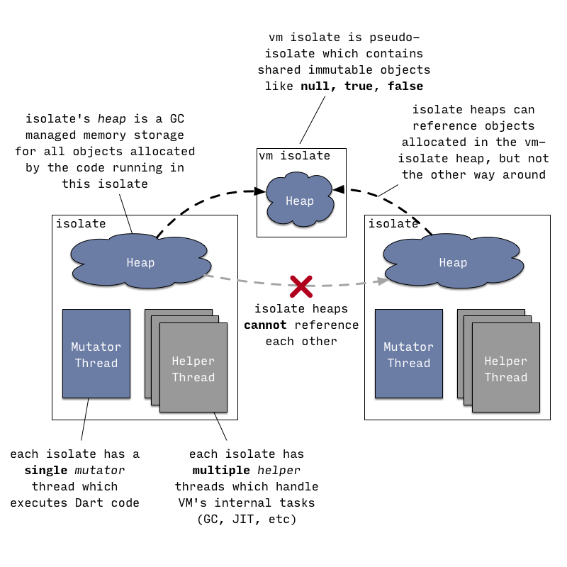
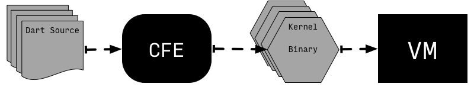
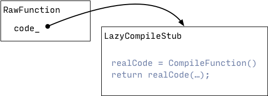

<!-- 2020-07-20 -> 26 专门研究dartVM-->
<!-- 翻译：特定调用点（call site） -->
[doc 原文](https://mrale.ph/dartvm/)

原文大致包括几个部分。
1. VM原理与机制
2. JIT运行模式 （本文简翻到此）
3. Snapshots快照运行模式
4. AppJIT 的快照运行模式
5. AppAOT 快照运行模式

# Dart VM 包含内容
除去基本的运行环境，VM内还有特殊的编译工具，用于flutter热更新，快速编译等等。
* 运行时系统
    * 对象模块
    * GC垃圾回收
    * 快照
* native方法核心库
* 通过 **service protocol** 访问的高级开发工具
    * debug工具
    * 性能工具
    * 热加载（注意，不是热修复）
* JIT，AOT编译管道
* 解释器（Interpreter）
* ARM模拟器

1. Dart不但可以通过jit编译，解释执行。
2. 还可以通过AOT管道编译，输出直接运行的机器码。（这样自然就没法继续增加源码解释执行了。）

# VM执行代码方式
* JIT解释执行
    * 源码
    * 内存二进制（Kernel binary）
* 快照直接执行
    * AOT快照
    * JIT的快照？（原文：from AppJIT snapshot.）
## VM与isolate结构。


注意点：
1. VM自己占据的isolate，是个伪隔离。包含那些不可变的对象，如：null，ture，false
2. isolate包含
    1. 堆（isolate heap）-> 运行代码生成的对象。被gc管理
    2. 线程（mutator thread）-> 代码运行线程
    3. 其他辅助线程（Helper Thread）-> GC，JIT，等等其他功能都在辅助线程中。
3. isolate堆，对象的访问问题。
    1. 子isolate之间不能共享对象，
    2. 子isolate可以从vm-isolate获取基础对象
4. isolate通讯问题。
    * message与port。
5. 系统线程与isolate的作用机制。
    * 底层走的是线程池机制，`ThreadPool` / `ThreadPool::Task`
        * https://www.cnblogs.com/lzpong/p/6397997.html
6. 代码实现
    * 类Isolate对应isolate
    * 类Heap 对应 isolate Heap
    * 类Thread 对应 isolate的附加线程，（跟系统的Thread，是不一样的。）
    * Dart_RunLoop 与 MessageHandler 实现了isolate的消息机制。

# JIT运行模式
从Dart2开始，VM没有直接执行源码的能力。
1. VM需要Dart内核抽象语法树来运行（Kernel ASTs）。
2. 源码到Kernel ASTs，需要用中间工具，通用前端编译(CFE)工具进行语法解析


值得注意的是，前端编译工具CFE在编译过程中所处的位置：
1. 与VM一起，解释后执行
2. Flutter模式，电脑中启动的frontend server编译，发送执行Kernel ASTs到远端设备被Flutter运行

> 源码用Raw前缀命名的是Dart Class在C++中的抽象表示。例如RawClass代指DartVM的Class，RawField是VM对象。

> 部分源码结构
> * `package:kernel/ast.dart` 定义了抽象语法树 - Kernel AST. 
> * `package:front_end` 实现了parser，实现对源码分析生成语法树 Kernel AST. 
> * `kernel::KernelLoader::LoadEntireProgram` 对Kernel AST进行反序列化，是程序入口点. 
> * `pkg/vm/bin/kernel_service.dart` 实现了内核服务的isolate （Kernel Service isolate）
> * `runtime/vm/kernel_isolate.cc` 实现了Dart与内核服务的融合。
> * `package:vm` VM基础内核相关方法，绝大多数都在这里, 
>   * 例如：变量在内核之间的传输，因为一些历史原因，一些特殊的传输方法还在 `package:kernel` 中。对于这些特殊方法，更直观一些的特定传输实现，如`async`,`async*` and `sync*`，位于 `package:kernel/transformations/continuation.dart`
> 

## 好奇心 - 内核编译输出Kernel AST。
> 这里需要使用sdk源码，我尝试贴出来到本demo。文件，依赖引用结构复杂。
* pkg/vm/bin/gen_kernel.dart 用于从源码生成二进制（Kernel binary）。
* pkg/vm/bin/dump_kernel.dart 生成结果可以用它dump出AST来。
* 想用这两个脚本测试的话，这里还用到了一个“交叉编译”的平台文件 `vm_platform_strong.dill`。
    * 这里包含了VM的基础核心库（core library）例如 dart:core dart:async
    * pkg/front_end/tool/_fasta/compile_platform.dart 负责生成对应平台的核心文件

```bash
# 到源码路径，执行，生成平台dill -> vm_outline.dill vm_platform.dill vm_outline.dill
dart pkg/front_end/tool/_fasta/compile_platform.dart \
       dart:core                                       \
       sdk/lib/libraries.json                          \
       vm_outline.dill vm_platform.dill vm_outline.dill

# Take hello.dart and compile it to hello.dill Kernel binary using CFE.
# 对hello.dart输出dill
$ dart pkg/vm/bin/gen_kernel.dart                        \
       --platform out/ReleaseX64/vm_platform_strong.dill \
       -o hello.dill                                     \
       hello.dart

# Dump textual representation of Kernel AST.
# dill输出到ast。
$ dart pkg/vm/bin/dump_kernel.dart hello.dill hello.kernel.txt
```

## 接JIT模式前文
初始阶段，所有的function使用占位符，指向一个LazyCompileStub入口点，其提供了可执行代码。当函数调用时，运行时转换其为可执行对象，然后调用。

如图，真正可执行代码，需要调用前才编译。

当代码第一次编译的时候。它被“不优化编译器”编译（Unoptimizing compiler）。然后生成机器码

### Unoptimizing compiler 步骤
1. 对函数体经过的AST生成 控制流程图（ control flow graph - CFG），CFG由基本的中间语言组成（intermediate language (IL) ）
    * 此阶段使用的IL指令类似于基于堆栈的虚拟机的指令：它们从堆栈中获取操作数，执行操作，然后将结果压入同一堆栈。
    * 不是所有的方法都有AST。有些IL直接使用已有的缓存，例如，native的c++方法（瞎翻，大意如此，有些中间语言直接用VM自带的底层机器码）
2. 每个IL都能转化成不通的架构的机器码，使用这种一对多的技术，CFG直接转换成不通架构的机器码。

在此阶段没有执行优化。未优化编译器的主要目标是快速生成可执行代码。

这也意味着它不会尝试静态解析任何未在内核二进制文件中解析的调用，因此编译为完全动态的。例如（MethodInvocation或PropertyGet AST节点）

VM当前不使用任何形式的基于虚拟表或接口表的调度，而是使用内联缓存（Inline caching）实现动态调用。

> inline caching 相关文章
> 内联缓存（Inline caching）是部分编程语言的运行时系统采用的优化技术，最早为Smalltalk开发。内联缓存的目标是通过记住以前直接在调用点上方法查询的结果来加快运行时方法绑定的速度。内联缓存对动态类型语言尤为有用，其中大多数（如非全部）方法绑定发生在运行时，因此虚方法表通常无法使用。
>
> https://baike.baidu.com/item/%E5%86%85%E8%81%94%E7%BC%93%E5%AD%98/22723133?fr=aladdin
>
>

> 内连机制没有翻译，跳过了。
> 优化代码执行小路，提前cache一样的代码，快速定位cache方法的执行路径，输出。反正就是快。需要的自行搜索其实现。

Unoptimizing compiler执行过程中会收集一些信息：
* 内联缓存关联 动态调用点（dynamic call site）接收类型信息
* 执行计数器，代码块热区统计

当执行计数器关联的方法达到某个阈值，这个方法就会被提交给 后台优化编译器（background optimizing compiler） 进行优化。

## background optimizing compiler 后台优化编译器
编译优化开始的过程跟非优化差不多，第一步都是，先序列化AST到未优化的中间语言IL，

然后与未优化编译之不同的是，第二步，不直接输出机器码，而是对IL进行转化，

转化为 静态单一分配（static single assignment (SSA) 。它是基于反馈信息，dart特性进行优化

例如：内联，范围分析，类型传播，表示形式选择，存储到加载和加载到加载转发，全局值编号，分配接收等。（机翻）

> 原文：e.g. inlining, range analysis, type propagation, representation selection, store-to-load and load-to-load forwarding, global value numbering, allocation sinking, etc. 

最后在线性的对寄存分配与多平台机器码的进行输出。（翻译不准）

优化编译完成之后，后台编译器请求进入mutator线程，替换函数的调用点为新的优化后代码段。等待下次执行。

> 源码
> * 编译器源位于`runtime/vm/compiler`目录中
> * 编译管道的入口点是 `CompileParsedFunctionHelper::Compile`
> * IL 定义位于 `runtime/vm/compiler/backend/il.h`
> * 内核到IL的转换始于 `kernel::StreamingFlowGraphBuilder::BuildGraph`
>   * 此功能还处理各种人工功能的IL构造。
> * `StubCode::GenerateNArgsCheckInlineCacheStub`为内联缓存生成机器代码块，
>   * `InlineCacheMissHandler` 处理内联失败的IC
> * `runtime/vm/compiler/compiler_pass.cc` 定义优化编译器通道及其顺序。
> * `JitCallSpecializer` 做了大多数的类型反馈的工作。

## dart JIT 执行参数。
具体查看原文。这里只看一条命令
```shell
# 运行test.dart并转储优化的IL和机器代码以用于个函数名称
# 中包含“ myFunction”的函数。 
# 禁用优化后台编译。
dart --print-flow-graph-optimized         \
       --disassemble-optimized              \
       --print-flow-graph-filter=myFunction \
       --no-background-compilation          \
       test.dart

# 新建了test.dart，实测了一下，没看到什么输出。个人不关注，跳过了。
```

## 投机假设与去优化 - speculative assumptions / deoptimization
优化编译过程中，编译器会对多次执行的部分进行推断优化，但是当新代码违反了其优化规则，就会导致去优化（deoptimization）
```dart
void printAnimal(obj) {
  print('Animal {');
  print('  ${obj.toString()}');
  print('}');
}

// 因为printAnimal多次执行，编译器则推断其为Cat，
for (var i = 0; i < 50000; i++)
  printAnimal(Cat());

// 这里突然变成了Dog，所以导致之前的假设失效
// 这就会导致去优化
printAnimal(Dog());
```
遇到这种情况，就会将调用点还原会未优化部分继续执行，因为其未优化，所以可以正常执行所有代码逻辑。

通常VM会抛弃已经优化过的版本，等待下次的类型反馈分析与假设优化。

### 防止 VM 作出推测假设的方法有两种：

1. 内联检查（比如 CheckSmi，CheckClass IL 指令），验证使用点假设的正确性。例如，当将动态调用转换为直接调用的时候，编译器回在直接调用前做这个检查。发生在这些检查上的去优化，被称为是急切去优化（eager deoptimization），因为他在检查发生时，就要做去优化的工作。
2. 全局保护，他指示运行时丢弃掉优化版本。比如优化编译器可能发现一些类 C 在类型传递过程中从来不会被继承。然后随后的代码可能会引入一个 C 的子类，那么这个推测就失效了。此时就需要运行时找到并丢弃掉所有在假设 C 没有子类的情况下做的代码优化。运行时可能会发现一些优化的代码已经无效了，在这种情况下，受影响的帧会被标记为去优化，并在执行返回时去优化。这种去优化被称作延迟去优化：因为只有当控制流反馈到优化的代码时才会进行。

> 源码阅读：
> * 去优化的代码位于 runtime/vm/deopt_instructions.cc 。 他本质上是一个小型的解释器，可以将优化的代码重新转换为未优化的代码状态。
> * 在优化代码中每个潜在可能去优化的位置处，都会通过 CompilerDeoptInfo::CreateDeoptInfo 中生成的去优化的指令。

尝试： 标志 --trace-deoptimization 会让 VM 打印出每个去优化发生位置的具体信息。 --trace-deoptimization-verbose 会让 VM 在去优化期间打印每一行去优化的指令。


