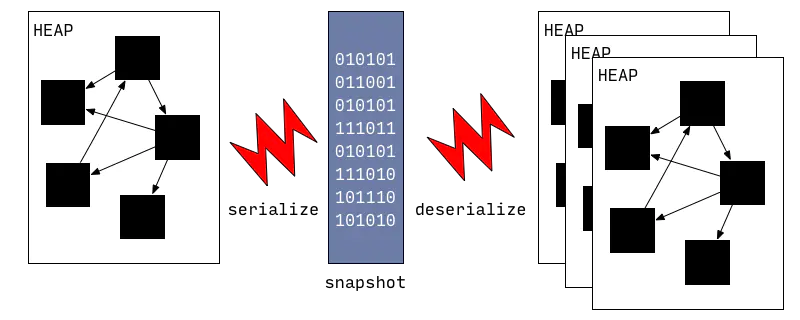
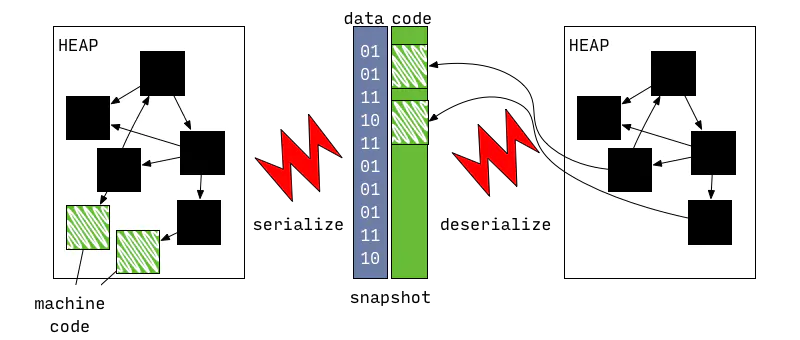

* [翻译]https://www.jianshu.com/p/a5b1997a01ba
* [原文]https://mrale.ph/dartvm/

# dartVM 从快照中运行
> 简单理解，vm从内存dump出快照，启动的时候直接还原回去。

* vm对isolate的堆，序列化成快照
* 直接将所有必要的数据从快照中解压缩出来，然后快速的生成一个 isolate 。

最早的快照启动模式，没有机器码支持。是随着AOT模式增加的新功能。

AOT是为了VM能在不支持JIT的平台上也能用快照（这里应该说的就是Flutter了。为了提高性能，执行速度，只用快照）


如图，支持机器码的快照，是两部分一部分是普通快照，一部分是机器码，反序列化时，机器码直接成为堆中的一部分。

> 源码导读
> * `runtime/vm/clustered_snapshot.cc` 处理快照的序列化和反序列化。
>   * `Dart_createXyzSnapshot` [AsAssembly]是一系列 API 函数，负责写出堆的快照（比如 Dart_CreateAppJITSnapshotAsBlobs 和 Dart_CreateAppAOTSnapshotAsAssembly）
> * Dart_CreateIsolate 可以选择启动时使用哪个快照。
> * 
# AppJIT 快照运行
引入了AppJIT快照，以减少大型Dart应用程序的JIT预加载时间，例如dartanalyzer或dart2js

AppJIT是为了解决：当开发时是用假数据，快照生成的结构仍然是可以被vm用来快速启动，即便观察到了数据变化，JIT仍然有效。从而加快了速度

> --snapshot-kind=app-jit --snapshot=path-to-snapshot参数可以用来生成JIT快照
这里的测试方法有兴趣可以看看，可以跳过。
```shell
# Run from source in JIT mode.
$ dart pkg/compiler/lib/src/dart2js.dart -o hello.js hello.dart
Compiled 7,359,592 characters Dart to 10,620 characters JavaScript in 2.07 seconds
Dart file (hello.dart) compiled to JavaScript: hello.js

# Training run to generate app-jit snapshot
$ dart --snapshot-kind=app-jit --snapshot=dart2js.snapshot \
       pkg/compiler/lib/src/dart2js.dart -o hello.js hello.dart
Compiled 7,359,592 characters Dart to 10,620 characters JavaScript in 2.05 seconds
Dart file (hello.dart) compiled to JavaScript: hello.js

# Run from app-jit snapshot.
$ dart dart2js.snapshot -o hello.js hello.dart
Compiled 7,359,592 characters Dart to 10,620 characters JavaScript in 0.73 seconds
Dart file (hello.dart) compiled to JavaScript: hello.js
```
# AppAOT 快照中运行
简单理解： 
* 为了启动速度，执行速度阉割了JIT，VM也就个变种VM。例如Flutter
* 产出了更死板的快照，没了JIT的“未优化-优化-负优化”过程。
* 可能是为了性能与快照大小，增加了一个`切换调用（Switchable Calls）`的模式，
    * 约等于保存“优化”与“未优化”两份代码在快照，变种VM根据执行情况动态切换

# 原文也未写完（等待后续）